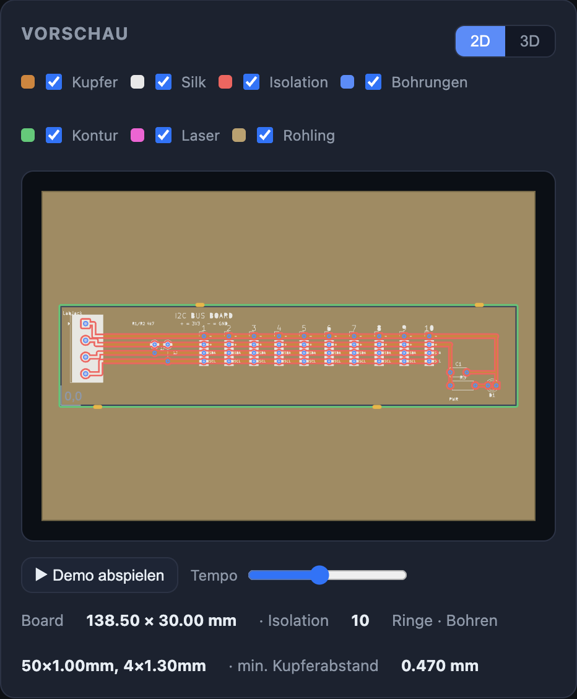
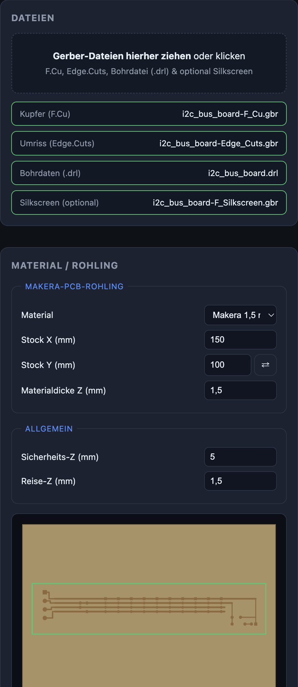
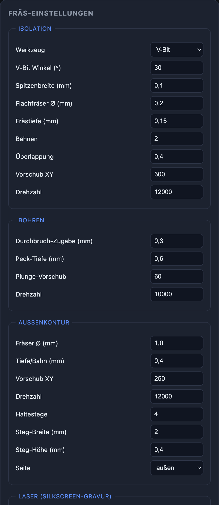
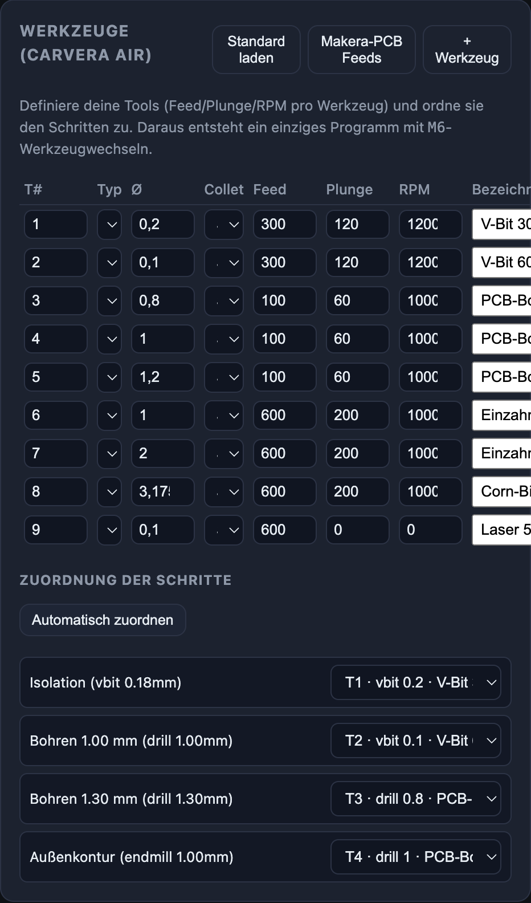
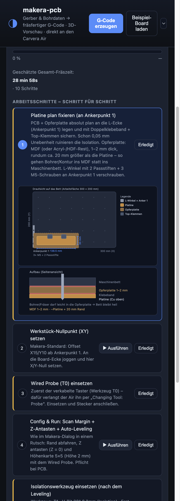
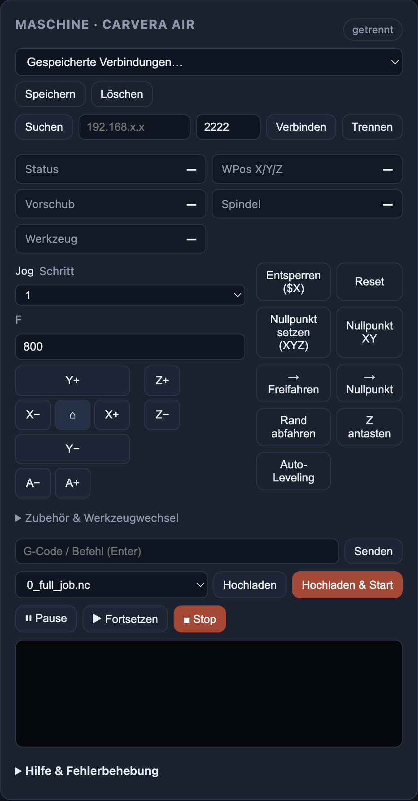

<div align="center">

# makera-pcb

**Aus KiCad-Gerber- + Bohrdaten wird fräsfertiger G-Code für die Makera Carvera Air – in einer App.**

Isolationsfräsen · Bohren · Außenkontur — mit Fräsbarkeits-Check, 2D-**und**-3D-Vorschau,
Werkzeug-Bibliothek (ein `M6`-Programm), KI-Check, komplett geführtem Fertigungsablauf und
**direkter Maschinen-Anbindung** (finden → Status → hochladen → starten). Kein FlatCAM, kein MakeraCAM nötig.


[English](README.md) · **Deutsch**



</div>

---

## ✨ Highlights

- **2D- + 3D-Board-Ansicht** — Kupfer, Silkscreen, Bohrungen und Fräsbahnen; drehbar in 3D (three.js).
- **Geführter, maßstabsgetreuer Ablauf** — Schritt für Schritt mit **exakten Carvera-Air-Grafiken**
  (300 × 200 mm Bett, Ankerpunkt 1, L-Winkel-Verschraubung, Opferplatte, Klemmen, Bemaßung).
- **Werkzeuge ↔ Schritte** — Feed/Plunge/RPM **pro Werkzeug**; jedem Schritt ein Werkzeug zuordnen →
  ein einziges **`0_full_job.nc`** mit `M6`-Wechseln (statt vieler Einzeldateien).
- **Offizielle Makera-Feeds** — ein Klick setzt alle Werkzeuge auf die Makera-Speeds&Feeds-Tabelle.
- **Direkte Maschinensteuerung** — UDP-Discovery, Live-Status, Jog, Antasten, Auto-Leveling, MDI,
  Upload & `play` — spricht das **binäre Framing-Protokoll** (Firmware ≥ 1.0.5, z. B. 1.0.6).
- **KI-Check (OpenAI)** — kennt die exakten Carvera-Air-Specs/Werkzeuge/Rohlinge und liefert
  konkrete Ein-Klick-Korrekturen.
- **UV-Lötstopplack-Ablauf** — Auftragen → Aushärten (mit Timer) → Pads freilegen, plus Laser-Silkscreen.
- **Zweisprachige UI (DE/EN)** und **Projekte** — kompletten Arbeitsstand speichern/laden/exportieren.

## 📸 Screenshots

| Material & Dateien | Fräs-Einstellungen | Werkzeuge & 1-Datei-Job |
|:---:|:---:|:---:|
|  |  |  |
| **Geführte Fertigung (maßstabsgetreu)** | **Maschinensteuerung** | **2D-/3D-Vorschau** |
|  |  |  |

## 🚀 Schnellstart

```bash
cd makera-pcb
npm install
npm start
```

`http://localhost:4321` öffnen, **„Beispiel-Board laden“** klicken (lädt das I²C-Board aus
`../platine/gerbers`) oder eigene Gerber per Drag & Drop einwerfen (F.Cu, Edge.Cuts, `.drl`
werden automatisch zugeordnet).

Die Oberfläche ist in **Workflow-Tabs** in der Reihenfolge des Vorgehens gegliedert:
**1 Material & Dateien · 2 Fräs-Einstellungen · 3 Werkzeuge · 4 Vorschau · 5 KI-Check ·
6 Maschine · 7 Fertigung · 8 Ergebnis**. „G-Code erzeugen“ ist immer oben erreichbar.

```
Gerber (F.Cu) ─┐
Edge.Cuts     ─┼─►  makera-pcb  ─►  1_isolation.nc · 2_drill_<Ø>.nc · 4_outline.nc
Drill (.drl)  ─┘                    0_full_job.nc (M6) · FERTIGUNGSPLAN.md
```

## 🧰 Werkzeuge & 1-Datei-Job


Im Card **„3 · Werkzeuge (Carvera Air)“** legst du deine Tools an (Nummer, Typ, Ø, Collet
S1–S6, **Feed/Plunge/RPM**, Bezeichnung – im Browser gespeichert).

- **PCB-Pack laden** füllt die Werkzeugliste des **Makera PCB-Fertigungspakets**
  (V-Bit 0,2 mm, Engraving 0,3/0,5 mm, Corn-Bit 2 mm, Spiral-O 2 mm, Bohrer 2 mm, Laser)
  inkl. Standard-Zuordnung und Fräser-Ø (Clearing/Kontur 2 mm).
- **Makera-PCB Feeds** setzt Feed/Plunge/RPM aller Werkzeuge exakt auf die offizielle
  Makera-Tabelle (PCB-Spalte): V-Bit 12000/500/200, Corn-Bit 12000/500/300,
  Bohrer 10000/1000/200, Lötstopplack-Entferner 6000/400/200.

Darunter ordnest du jedem Schritt ein Werkzeug zu – die Liste folgt der Fertigungs-Reihenfolge
und deckt **alle aktiven Schritte** ab: Isolation, Kupfer-Clearing, Lötstopplack-Entfernung,
Bohren je Ø, Außenkontur und Laser-Silkscreen („Automatisch zuordnen“ per Typ/Ø; die Liste
aktualisiert sich live beim Umschalten der Optionen). Sind alle Spindel-Schritte belegt, entsteht
zusätzlich **`0_full_job.nc`** – ein einziges Programm mit `M6 T… S…`-Wechseln in der richtigen
Reihenfolge (Isolation → Clearing → Bohren → Kontur). Beim Carvera Air fährt jeder `M6` an die
Wechselposition, piept und **wartet** — makera-pcb erkennt diesen Wartezustand live und öffnet
einen ganzseitigen **Werkzeugwechsel-Dialog** (Desktop *und* Mobile) mit dem Werkzeugnamen und
einem Bestätigen-Button, der die Maschine fortsetzt; danach misst sie die Werkzeuglänge
automatisch. Schritte **außerhalb** des
Spindel-Jobs sind gekennzeichnet: der Laser läuft als eigenes Programm (`M321` wirft das
Werkzeug ab), die Lack-Entfernung ist ein geführter Handschritt ohne G-Code.

<br clear="all" />

## 🧱 Material / Rohling


Im Tab **Material & Dateien** wählst du den **Rohling** – mit den Standard-Makera-PCB-Blanks
(FR4 1,5 mm, ein-/doppelseitig, **100×150** und **150×200 mm**) plus „FR4 generisch 1,6 mm“
und „Eigenes Material“. Die Auswahl setzt Dicke (Z) und Stock-Maße (X/Y, mit ⇄-Tausch). Eine
**Live-Vorschau** zeigt den Rohling an den Schenkeln des L-Winkels mit der Platine dort,
wo sie real liegt, und ob sie **passt**. Vorschau, Fräsbarkeits-Check und Report nutzen
**eine** gemeinsame Fit-Regel (`web/public/stock-fit.js`) auf Basis der verifizierten
Anker-Geometrie: Der Werkstück-Nullpunkt sitzt **genau auf Anker 1 = der Rohling-Ecke**
(auf einer echten Maschine bestätigt – kein X15/Y10-Offset), das Board beginnt also
**an der Rohling-Ecke** — Board + ~4 mm Klemm-Rand rechts/oben müssen auf den Rohling
passen, Drehung zählt mit.
Passt das Board nicht, zeigt der Material-Tab eine **rote Warnung** mit dem benötigten
Maß und dem kleinsten passenden Makera-Rohling.

**Platzierung per Drag & Drop:** Die Platine lässt sich in der Vorschau greifen und
auf dem Rohling verschieben (Maus + Touch) – z. B. weg von der Ecke für mehr
Sicherheitsabstand. Sie rastet auf einem **0,5-mm-Raster** ein, wird an den Rohling
geklemmt (inkl. Klemm-Rand, rote Warnung bei Überstand), und die numerischen Felder
**Versatz X/Y** bleiben synchron (plus „Zurücksetzen“-Button). Der
**Werkstück-Nullpunkt bleibt an Anker 1 (= Rohling-Ecke)** – stattdessen werden alle
erzeugten Programme (Isolation, Clearing, Bohren, Kontur, Laser) um den Versatz
verschoben, und Scan Margin / Z-Antasten / Auto-Leveling laufen auf der versetzten
Board-Fläche. Der Versatz wird mit dem Projekt gespeichert.

<br clear="all" />

## 🛠 Geführte Fertigung (maßstabsgetreue Grafiken)


Der **Fertigungs-Tab** nimmt dich beim echten Herstellen an die Hand – in exakt der
Makera-Reihenfolge (**erst Wired Probe – Rand/Z/Leveling – dann das Schneidwerkzeug**):

1. **Platine plan fixieren** an Ankerpunkt 1 (maßstabsgetreue Draufsicht + Seitenansicht des Aufbaus).
2. **XY-Nullpunkt setzen** (genau auf Anker 1 = Platinen-Ecke).
3. **Wired Probe (T0) einsetzen & messen** — ein echter `M6 T0` (Wechsel-Overlay),
   danach misst die Firmware den Probe am Längensensor. Diese Messung ist die
   Referenz, gegen die später alle Werkzeuglängen verrechnet werden.
4. **Config & Run:** Scan Margin + Auto Z Probe **auf der Platine am Werkstück-
   Nullpunkt** (`M495 … O0 F0` — beide Buchstaben; `O` ohne `F` wäre die
   4.-Achsen-Absolut-Probe der Firmware, die Z0 ~23 mm unter die Oberfläche legt)
   + Auto Leveling (5×5…9×9, H2) in einem Rutsch. Danach wird die **Höhenkarte**
   aus dem Maschinen-Log gelesen, als farbcodierte **3D-Fläche** angezeigt
   (grün = eben, rot = Abweichung) und auf Plausibilität geprüft
   (Gesamtabweichung / Verkippung / Ausreißer).
5. **Isolationswerkzeug einsetzen** (Werkzeuglänge wird bei jedem Wechsel automatisch gemessen).
6. Isolation fräsen → optional Kupfer-Clearing → (optional UV-Lötstopplack: reinigen →
   auftragen → aushärten → Pads freilegen) → Bohren → Kontur → optional Laser-Silkscreen →
   entnehmen & finishen.

Jeder Schritt hat eine **maßstabsgetreue Illustration der echten Carvera Air** (300 × 200 mm
Arbeitsfläche, grauer L-Winkel an Ankerpunkt 1 mit **2 Passstiften + 3 M5-Schrauben**,
Opferplatte, Top-Klemmen, Platine **in mm bemaßt**). Je Schritt gibt es geschätzte Zeit,
Werkzeug, **▶ Start** (lädt die passende `.nc` hoch und startet) und einen „Erledigt“-Haken;
UV-Lack-Schritte haben einen Aushärte-Timer. Maschinen-Schritte werden **live überwacht**
(`web/public/job-monitor.js`): Der Start deaktiviert die Buttons und zeigt „läuft…“, ein
M6-Wartezustand öffnet den **Werkzeugwechsel-Dialog** (Desktop *und* Mobile-Fernbedienung),
ein fertiger Lauf hakt den Schritt automatisch ab und schaltet den nächsten frei, ein Alarm
markiert ihn als **fehlgeschlagen** mit Klartext-Hinweis statt weiterzuschalten. Die Schritte
sind der Reihe nach gegated — ein späterer Schritt fragt vorher explizit nach.

> **Opferplatte:** MDF (oder Acryl-/HDF-Rest), **1–2 mm** dick, rundum ca. **20 mm** größer als
> die Platine – so gehen Bohrer/Kontur ins MDF statt ins Maschinenbett.

<br clear="all" />

## 🤖 Maschinensteuerung (Carvera Air)


1. **Suchen** — findet die Maschine per UDP-Broadcast (Port 3333, markiert **frei/belegt**).
2. **Verbinden** — TCP (Port 2222). Protokoll auto-erkannt (Framing-Firmware ≥ 1.0.5 oder
   alte Klartext-Firmware). Danach: Live-Status, MDI, **Hochladen** und **Hochladen & Start (play)**.
3. **Verbindungsprofile** — IP/Port als benanntes Profil speichern.

Ganz oben im Maschinen-Tab führt ein **Setup-Assistent** mit Zustands-Erkennung durch jedes
neue Projekt: 1 Verbinden → 2 Referenzfahrt/Alarm (mit „Alarm quittieren“-Button) →
3 Platine an Anker 1 einlegen → 4 Nullpunkt setzen → 5 Z antasten & Auto-Leveling →
6 Job starten. Jeder Schritt hat ein Status-Icon, EINEN Button und einen Satz Erklärung.

**Gerätesteuerung** (gruppiert in *Einrichten*, *Fahren* und *Alarm & Reset*): Jog-Pad
(X/Y/Z/A), Home/Entsperren/Reset; **„Nullpunkt = Anker 1“** — ein Klick, bewusst
fehlertolerant: erst Zustandsprüfung (Alarm/Referenzfahrt/laufende Bewegung werden mit
Klartext-Meldung abgelehnt), dann `M496.3` (die Firmware hebt selbst Z an und fährt zum
Anker), dann **warten bis die Maschine wieder Idle ist** — `M496.x` wird von der Firmware
verzögert auf dem Main-Loop ausgeführt, ein direkt danach gesendeter Befehl würde die Fahrt
überholen — und erst dann `G10 L20 P0 X-15 Y-10` (reine Koordinaten-Buchhaltung, keine
weitere Fahrt, kein Soft-Endstop-Risiko); **Nullpunkt setzen XYZ/XY** an der gejoggten
Position, **„→ Parkposition (oben rechts)“** (`M496.1`), **„→ Werkstück-Nullpunkt“**
und **„Gehe zu (Werkstück-X/Y)“** (beide fahren in *deinem* Werkstück-Koordinatensystem und
heben Z zuerst sicher an); Rand abfahren, Z antasten, Auto-Leveling; ein **Zubehör**-Panel für
Licht, die externe Absaugung, Air Assist, Spindel-Lüfter, Piep, Spannzange öffnen/schließen,
Kalibrieren, Höhenkarte zeigen/löschen; Pause/Fortsetzen/Stop; Live-Fortschritt; und ein
**Alarm-Banner** mit Klartext-Hinweisen + Troubleshooting-Panel.

> **Absaugungs-/Luftreiniger-Automatik:** Ein externer Sauger/Luftreiniger am
> **externen Schaltausgang** der Carvera Air wird mit `M851`/`M852` geschaltet
> (Firmware `switch.extendout`, verifiziert in `config2.default` — `M331`/`M332`
> würden auf der Air nur den *nicht angeschlossenen* internen Vacuum-Switch
> scharfschalten). Mit aktivierter Automatik (Default **an**, Zubehör-Panel)
> schaltet jedes erzeugte Programm den Ausgang nach dem Spindelstart ein und nach
> Programmende mit konfigurierbarem **Nachlauf** (Default 10 s, `G4`-Dwell) wieder
> aus — das steckt im G-Code selbst und funktioniert damit auch ohne App.
> Zusätzlich schaltet die Job-Überwachung der App nach **Abbruch/Fehler** aus
> (deren Dateien ihr eigenes `M852` nie erreichen), kann die Absaugung optional
> beim `M6`-Werkzeugwechsel pausieren und deckt das separate Laser-Programm ab.
> Der manuelle An/Aus-Toggle bleibt erhalten (Desktop + Mobile) und zeigt den
> zuletzt gesendeten Zustand.

> **Koordinaten:** Der eingebaute Nullpunkt der Maschine (MPos 0/0) ist die Referenz-Ecke
> **oben rechts** (Homing) — dein Werkstück-Nullpunkt an der Platine entsteht erst durch
> *Nullpunkt setzen*. Die Statusanzeige zeigt **WPos (Werkstück)**, **MPos (Maschine)**,
> ein Badge **„Werkstück-Nullpunkt: gesetzt / nicht gesetzt“** und eine **Auto-Leveling**-
> Zeile (das `O:`-Statusfeld der Firmware = max. Höhenkarten-Abweichung bei aktiver
> Kompensation); Fahrten im Werkstück-System und Job-Starts warnen, wenn noch kein
> Nullpunkt gesetzt ist (sonst würde ab der Ecke oben rechts gerechnet).

> **Sicherheits-Gate vor jedem Job-Start:** Die App startet nicht stumm, wenn
> (a) kein Z-Nullpunkt erkennbar ist (WCO-Z = 0 — Z seit dem Homen nie angetastet) oder
> (b) die Höhenkarte / aktive Kompensation mehr als **0,4 mm** abweicht
> (`LEVELING_MAX_DEV_WARN_MM`), > 0,3 mm verkippt ist oder Ausreißer-Zellen enthält —
> jeweils mit Klartext-Hinweis, was physisch zu prüfen ist.

> **Protokoll:** Aktuelle Firmware (≥ 1.0.5, z. B. Carvera Air **1.0.6**) spricht ein **binäres
> Framing-Protokoll** (`0x8668 … CRC16 … 0x55AA`) – ein blankes `?` wird ignoriert (deshalb blieb
> der Status früher leer). Diese App erkennt das automatisch und verpackt Befehle, Realtime-Bytes
> und Datei-Upload passend. Der Carvera bedient nur **einen** Client – MakeraCAM/Controller vorher
> beenden (und USB ziehen).

<br clear="all" />

## 📱 Mobile Fernbedienung

Auf dem Handy `http://<rechner-ip>:4321/mobile` öffnen (gleiches WLAN) — URL und QR-Code werden
beim Serverstart ausgegeben. Eine touch-optimierte Fernbedienung für direkt an der Maschine:
Verbinden/Suchen, Live-Status (WPos prominent, MPos sekundär), Jog-Pad mit Schrittweiten
(0.1/1/10 mm), Home/Entsperren, zum Werkstück-Nullpunkt fahren, Origin setzen (mit Bestätigung),
Pause/Fortsetzen/Stop (Stop mit Bestätigung), Job-Fortschritt, Alarm-Banner und Zubehör-Schalter.
Die Maschinen-Verbindung hält der Server — Desktop und Handy teilen sie sich. DE/EN, keine
CAM-Funktionen — reine Fernbedienung.

## 🧠 KI-Check (OpenAI)

OpenAI-Key eintragen (bleibt lokal im Browser, oder `.env`), Modell wählen (Default `gpt-5.5`)
und **„Konfiguration prüfen“**. Die KI bewertet Fräsbarkeit/Feeds/Speeds/Tiefen für *dieses*
Board und liefert konkrete **Korrekturen als Patch**, die du mit einem Klick übernimmst.

`makera-pcb/.env` anlegen (Vorlage: `.env.example`):

```
OPENAI_API_KEY=sk-...
OPENAI_MODEL=gpt-5.5
```

`.env` ist git-ignored und wird beim Start automatisch geladen. Mit Server-Key zeigt der Check
„aktiv (.env)“, und der **Auto-Check** läuft nach jeder Erzeugung.

## 💾 Projekte & 🌐 Sprache

- **Projekte:** kompletten **Arbeitsstand** speichern/laden (Gerber-Dateien, alle Einstellungen,
  Werkzeuge, Zuordnungen, Material, Layer), als `*.mkpcb.json` exportieren/importieren. Das zuletzt
  geöffnete Projekt wird beim Start automatisch wiederhergestellt.
- **Sprache:** DE/EN-Umschalter (oben rechts) schaltet die komplette UI live um – Tabs, Formulare,
  geführte Schritte, Diagramme, Troubleshooting, Meldungen. Die Wahl wird gemerkt.

## ⌨️ Kommandozeile

```bash
# ganzen Gerber-Ordner verarbeiten
node src/cli.js ../platine/gerbers --out out

# einzelne Dateien
node src/cli.js --copper F_Cu.gbr --edge Edge_Cuts.gbr --drill board.drl --out out

# Parameter überschreiben
node src/cli.js ../platine/gerbers --set isolation.cutDepth=0.12 --set outline.tabs=6
```

Ergebnis liegt in `out/` (`*.nc` + `FERTIGUNGSPLAN.md`).

## ⚙️ Konfiguration

| Bereich | Schlüssel | Default | Bedeutung |
|---|---|---|---|
| Material | `material.thickness` | 1.5 | Materialdicke (mm) |
| Allgemein | `safeZ` / `travelZ` | 12 / 2 | Querfahrt über Klemmen/Platine / kurzer Sprung zwischen nahen Features auf der Platine |
| Isolation | `isolation.tool` | `vbit` | `vbit` oder `endmill` |
| | `isolation.vbitAngleDeg` | 30 | V-Bit-Spitzenwinkel |
| | `isolation.tipWidth` | 0.2 | Spitzenbreite (mm, PCB-Pack V-Bit 30° 0,2 mm) |
| | `isolation.cutDepth` | 0.15 | Frästiefe ins Kupfer (mm) |
| | `isolation.passes` | 2 | Anzahl Isolationsbahnen |
| | `isolation.overlap` | 0.4 | Überlappung der Bahnen (0–0.9) |
| | `isolation.feedXY` / `rpm` | 300 / 12000 | Vorschub / Drehzahl |
| Bohren | `drill.throughMargin` | 0.3 | Durchbruch-Zugabe (mm) |
| | `drill.peck` | 0.6 | Peck-Tiefe pro Zustellung (mm) |
| | `drill.remap` | `[]` | Bohrer umbelegen, z. B. `[{ "from":1.3, "to":1.2 }]` |
| Kontur | `outline.cutterDiameter` | 2.0 | Fräser-Ø (mm, PCB-Pack Spiral-O 2 mm) |
| | `outline.depthPerPass` | 0.4 | Tiefe pro Bahn (mm) |
| | `outline.throughMargin` | 0.2 | Durchbruch unter Materialunterseite im letzten Pass (mm) |
| | `outline.tabs` | 4 | Anzahl Haltestege |
| | `outline.tabWidth` / `tabHeight` | 2 / 0.4 | Steg-Breite / verbleibende Materialhöhe unter jedem Steg (mm) |
| | `outline.offsetSide` | `outside` | `outside` / `on` / `inside` |
| Platzierung | `placement.offsetX` / `offsetY` | 0 / 0 | Board-Versatz ab Rohling-Ecke (Drag & Drop, mm) |
| Absaugung | `vacuum.enable` | `true` | Automatik für den externen Ausgang (M851/M852) in jedem Programm |
| | `vacuum.lingerSec` | 10 | Nachlauf nach Programmende (s, `G4`-Dwell) |
| | `vacuum.pauseToolChange` | `false` | Beim `M6`-Werkzeugwechsel-Warten ausschalten |
| | `vacuum.laser` | `true` | Auch im separaten Laser-Programm mitlaufen |

Die effektive V-Bit-Breite wächst mit der Frästiefe (`tipWidth + 2·cutDepth·tan(Winkel/2)`)
und geht in den Fräsbarkeits-Check ein.

## 🏗 Wie es funktioniert

| Modul | Aufgabe |
|---|---|
| `src/gerber/` | RS-274X-Parser (Format, Aperturen, Macros inkl. `RoundRect`, Flashes/Draws/Regionen, Polarität, Bögen) |
| `src/excellon/` | Bohrdaten (Tools, Koordinaten, Slots) |
| `src/geometry/` | Clipper-Wrapper: Union/Difference/Offset, Kreis-Approximation |
| `src/cam/` | Isolation (konzentrische Offsets), Clearing (Restkupfer-Abtrag), Bohren (Peck, Nearest-Neighbour), Kontur (Stitching, Offset, Haltestege), G-Code |
| `src/cam/checks.js` | kleinster Kupferabstand (Offset-bis-Merge) vs. Werkzeug + Stock-Fit |
| `src/machine.js` | Carvera-Netzwerk: UDP-Discovery, Framing-Protokoll (auto-erkannt) + Klartext-Fallback, Live-Status, MDI/Realtime, Datei-Upload |
| `src/ai.js` | OpenAI-Konfig-Review (Prompt/Parser testbar, API-Call im Server) |
| `web/public/app.js` | UI: 2D/Demo-Animation, Werkzeuge, KI-Check, Maschine (inkl. Setup-Assistent), Projekte |
| `web/public/machine-commands.js` | reine Kommando-Builder + WCO-/Nullpunkt-Helfer der Maschinensteuerung (unit-getestet) |
| `web/public/stock-fit.js` | gemeinsame Fit-Regel Board↔Rohling (Anker-Offset + Klemm-Rand) für UI-Vorschau **und** Fräsbarkeits-Check |
| `web/public/i18n.js` | DE/EN-Wörterbuch + `t()`/`applyI18n()` (Sprachumschaltung) |
| `src/pipeline.js` | verbindet alles → Dateien, Report, 2D/3D-Vorschau |

> Die 3D-Ansicht nutzt ein vorgebautes Bundle (`web/public/view3d.bundle.js`). Nach Änderungen
> an `web/public/view3d.js` neu bauen mit `npm run build:viewer`.

## 🚧 Grenzen

- Nur die **F.Cu-Lage** wird isoliert (einseitig; kein Spiegeln für doppelseitig).
- Optionales **Kupfer-Clearing** (Hintergrund-Kupfer flächig abräumen) mit Flachfräser/Corn-Bit —
  standardmäßig aus (`clearing.enable`).
- Geroutete Langlöcher in der Bohrdatei werden gemeldet, aber nicht automatisch gefräst.

## ✅ Tests

```bash
npm test
```

Deckt Geometrie, Aperturen/Macros, Gerber- und Excellon-Parser, Kontur-Stitching, das kombinierte
`M6`-Programm (inkl. Clearing drin / Laser & Lack-Schritte draußen), den Carvera-Status-Parser,
CRC16/XMODEM, den Framing-Encoder und einen Datei-Upload über das Framing-Protokoll gegen einen
protokolltreuen Mock, die Koordinaten-Logik der Maschinensteuerung (Werkstück-Goto, die
zweiphasige Anker-1-Nullpunkt-Sequenz inkl. Vorbedingungs-Checks, WCO-/Nullpunkt-Erkennung),
die gemeinsame Stock-Fit-Regel (Beispielboard 138,5×30: passt auf den Standard-Rohling
150×100 — der Anker-Offset überspringt nur die Winkel-Schenkel; 100×50 schlägt korrekt fehl),
die Job-Monitor-Zustandsmaschine (läuft / Werkzeugwechsel-Wartezustand / fertig / fehlgeschlagen,
inkl. der M6-Handwechsel-Semantik des Air),
den Status-Parser gegen byte-getreue Firmware-1.0.6-Statuszeilen (5-Achsen-MPos/WPos,
Handwechsel-T-Feld, Leveling-`O:`-Feld, Halt-Grund),
die M495-Automations-Builder (Regression: die Werkstück-Z-Probe trägt immer `O` **und**
`F` — `O` allein wählt die 4.-Achsen-Probe der Firmware und legt Z0 ~23 mm unter die
Oberfläche; plus Platzierungs-Versatz in X/Y/C/D), den Höhenkarten-Parser + die
Plausibilitäts-Bewertung (gegen das echte 9×5-Leveling-Log), die projektbezogene
Reset-Logik, die Absaugungs-Automatik (M851/M852 in jedem erzeugten Programm:
an nach Spindelstart, aus nach Programmende mit Nachlauf-Dwell, optionale
Werkzeugwechsel-Pause, Laser-Schalter, plus der app-seitige Übergangs-Plan),
den Platzierungs-Versatz (verschiebt jede Operation im G-Code, während Vorschau
und Geometrie boardlokal bleiben, fließt in den Fit-Check, Raster- + Klemm-Regeln),
die Vollständigkeit der Schritt-Zuordnung je Konfiguration, die KI-Hilfsfunktionen sowie einen
End-to-End-Lauf auf dem echten I²C-Board ab.
